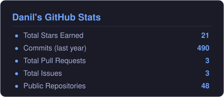
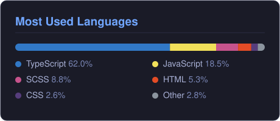
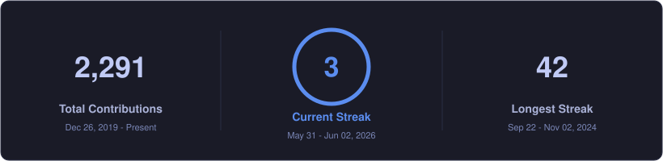
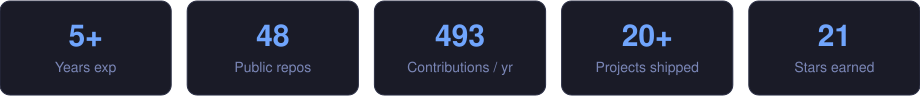

<!-- GitHub profile README for @boymep (Danil Panov) — lives in repo "boymep/boymep" and renders on the profile page. -->

<!-- ===== HEADER BANNER (self-hosted animated SVG) ===== -->

  

<!-- ===== SOCIAL / STATUS ROW ===== -->

  
  
  
  
  

<!-- ===== TYPING SUBTITLE ===== -->

  

---

## 👨‍💻 About me

> **Frontend-first Fullstack developer** with **5+ years** of commercial experience.
> I take products end-to-end — from UI and design systems to Node.js APIs and deployment.

&nbsp;

🏢 &nbsp; **Companies** &nbsp;—&nbsp; Cloud.ru · TokenSpot · Air Production · Now Agency · Lost Lore

🔧 &nbsp; **Specialties** &nbsp;—&nbsp; Web3 · Telegram Mini Apps · LLM integrations · Design systems · SEO & localization

🌱 &nbsp; **Currently building** &nbsp;—&nbsp; [Workice](https://workice.ru) — an AI-powered SaaS

🗣 &nbsp; **Languages** &nbsp;—&nbsp; Russian (native) · English (B2)

💼 &nbsp; **Open to** &nbsp;—&nbsp; Interesting projects & collaborations · Frontend / Fullstack · Remote

📍 &nbsp; **Based in** &nbsp;—&nbsp; Saint Petersburg · UTC+3 · Mon–Fri, 10:00–20:00

---

## 🛠️ Tech Stack

  

<b>Frontend:</b> React · Next.js · TypeScript · JavaScript · Vue · React Native 
<b>State & Data:</b> Redux · MobX · Zustand · React Query · Apollo / GraphQL 
<b>Styling & UI:</b> SCSS · Tailwind · MUI · Emotion · Styled Components · Framer Motion · Storybook 
<b>Backend & Tooling:</b> Node.js · MongoDB · Docker · Nginx · Webpack · Vite · Bun · Turbo · GitLab CI · Figma 
<b>Web3 & Real-time:</b> Solidity · Web3.js · Ethers · wagmi / viem · Socket.IO · Telegram Mini Apps · LLM

---

## 🚀 Featured Work

### 🏢 Commercial work
> Products I built the frontend for; links point to the live sites. Full case studies → **[danilpanov.ru/cases](https://danilpanov.ru/cases)**

| Project | What it is | Stack |
| --- | --- | --- |
| **[Workice](https://workice.ru)** ⭐ | AI-powered SaaS for managing projects and orders | Next.js · TypeScript · Redux · LLM |
| **[TokenSpot](https://tokenspot.com)** | Licensed crypto exchange — web and mobile, with a trading terminal | Next.js · React Native · TypeScript · GraphQL · Redux · MUI |
| **[Dream Island](https://dreamisland.ru)** | Resort and lifestyle platform; led the frontend | Next.js · TypeScript · Redux · next-intl |
| **[Dream Beach Club](https://dbc.dreamisland.ru)** | Beach-club website with interactive maps | React · Redux · React Leaflet · SCSS |
| **[Cloud.ru](https://cloud.ru)** | Cloud platform UI and internal console — microfrontends & shared design system | TypeScript · Next.js · Redux · Storybook · React Query |
| **[Console Cloud.ru](https://console.cloud.ru)** | Cloud management console | TypeScript · React · Redux · Styled Components · React Query · Storybook |
| **[Zeta.kz](https://zeta.kz)** | Furniture e-commerce (Kazakhstan); led the frontend | Next.js · Redux · next-intl · Dadata |
| **[Koreana Light](https://koreanalight.ru)** | Korean street-food café (Saint Petersburg) | Next.js · Redux · SCSS · next-intl |
| **[AvroraCity](https://avroracity.ru)** | Real-estate agency website | Next.js · MUI · Emotion · Framer Motion · Zod |
| **8legends.ai** | Web3 game and Telegram Mini App _(no public link)_ | Next.js · Web3.js · Ethers · Telegram API |
| **8 Legends TMA** | Telegram Mini App for the 8legends game _(runs inside Telegram)_ | Next.js · Redux · i18next · Telegram API |
| **[ChaChingAds](https://chachingads.com)** | Ad-creative platform | React · Vite · Redux · Tailwind |
| **[Moscow Concert Hall](https://moscow-hall.ru)** | Concert-venue website | Next.js · Redux · SCSS |
| **[Lazy App](https://lazyapp.ru)** | Real-time cross-platform app | React · Vite · Ionic · Socket.IO · Firebase |
| **[МЫЖ (MYZH)](https://myzh.pro)** | Creative-agency website | Next.js · Redux · Framer Motion · Swiper |

### 🧪 Personal projects

| Project | What it is | Stack |
| --- | --- | --- |
| **EnchantX** | AI-powered smart-reply tool (SaaS and browser extension) | Next.js · MongoDB · LLM |
| **FightFlow** | Web3 application with on-chain interactions | Next.js · wagmi · viem · web3 · RTK Query |
| **KickAssJS** | Interactive JavaScript learning playground | React · CodeMirror · Prism |
| **[danilpanov.ru](https://danilpanov.ru)** | This portfolio website | Next.js · next-intl |

---

## 📊 GitHub Analytics

  
  

  

  

  

<!-- ===== CONTRIBUTION SNAKE (requires a GitHub Action — see note below) ===== -->

  

---

## 📫 Connect with me

  
  
  
  
  

  

